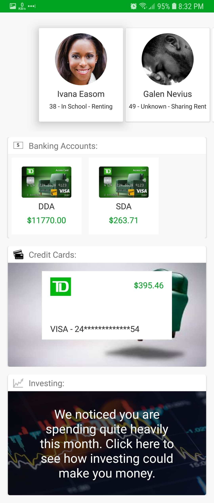
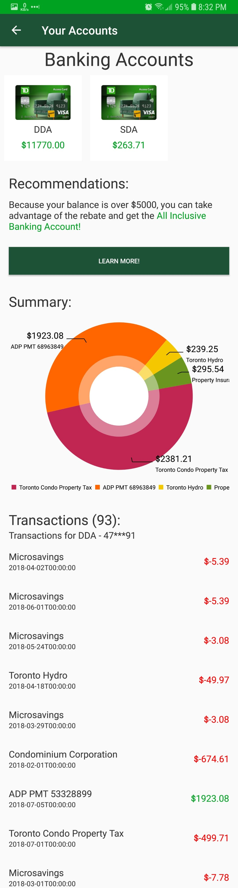
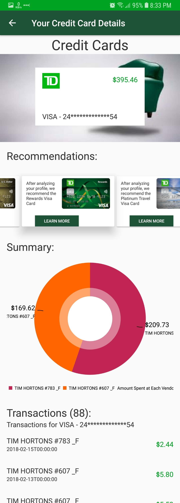

# TDMyLevelUp
An Android application that analyzes a user's transactions and recommends TD Products to allow the user to make better financial decisions.

## Overview
### Problem
When people start trying to improve their financial furute, they tend to change their lifestyle. 
This includes changing the type of account they have. 
However, there are a plethora of different TD accounts, credit cards, and thousands of investing products.
Which one is the best for them? 

### Benifits
* Encourages customers to take higher advantage of existing TD Products
* Encourages customers to save more and invest money
* Gives customers a starting off point
* Shows customers what he/she could do better
* Adapts to user's specific needs
* Increases financial litericy
* Increases knowleadge of TD Products

### Features
* Allows for multiple users
* Shows Bank Account Summaries
  * Analyzes a user's transactions to recommend a bank account
  * Shows user a pie chart showing what the user is spending money on
  * Show all of the user's transactions
* Shows Credit Card Account Summaries
  * Analyzes a user's transactions to recommend credit card accounts
  * Shows user a pie chart showing what the user is spending money on
  * Shows all of the user's transactions, showing if it's incoming or outgoing money
* Investing Simulator - What could have been
  * Shows how much money the user would have if the user had bought stocks in a specific company instead of spending it on something else
  * Allows user to filter different NASDAQ symbols and pick one
  * Shows users a candlestick chart showing recent history of the symbol
  * Shows transactions that must have been made

## Screenshots

| Dashboard | Personal Banking | Personal Banking | 
| ------------- | ------------- | ------------- |
|  |  |  |

| Investing Symbol Search Default State | Investing Symbol Searching | Investing Simulation Results | 
| ------------- | ------------- | ------------- |
|  |  |  |
  
## Running the Application
### Prerequisites:
1. [An internet connection](https://www.google.com/) - To talk to backend and to download dependencies
2. [Android Studio](https://developer.android.com/studio/) - To run android code
    1. The latest version of Studio
    2. Device or emulator with android 7.0 Minimum

## Resources
### TD APIs
- [BOTS Financial API](http://botsfinancial.com/app/login) - The API used to obtain user data
- [BOTS Financial Swagger](https://dev.botsfinancial.com/swagger-ui.html#/) - The Swagger Documentation
### Investing APIs
- [Alpha Vantage](https://www.alphavantage.co/) - Historical Stock Market Data
- [Yahoo Finance API](https://developer.yahoo.com/yql/) - Search for Investing Symbols
### Android APIs
 - [RVAbstractions](https://github.com/TheRishabhB/RecyclerViewAbstractions) - A set of abstract classes made by me to 
 allow for faster android development
  - [MPAndroidChart](https://github.com/PhilJay/MPAndroidChart) - Charts for Android
### Alternative Version
- [iOS Version](https://github.com/simubank/project13-spaceinvaders)
